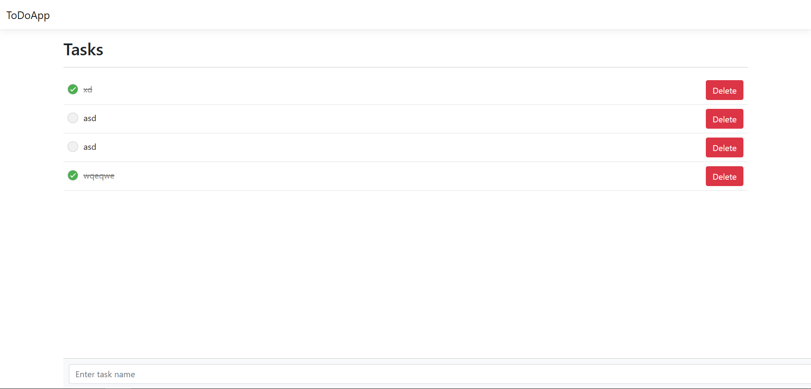

# ToDoApp

**ToDoApp** is a simple task management application built with **ASP.NET Core MVC** and **Entity Framework Core**. It allows users to create, edit, delete, and toggle the completion status of tasks in a clean and user-friendly interface.

---

## Features

- **Task Management**
  - Add new tasks with a name and completion status.
  - Edit task names inline.
  - Delete tasks.
  - Toggle the completion status of tasks with a single click.

- **User-Friendly Interface**
  - Inline editing of task names.
  - Tasks visually indicate their completion status (line-through for completed tasks).
  - Fixed input bar for adding new tasks.

- **Responsive Design**
  - Simple and minimal design using custom CSS and HTML.

---

## Tech Stack

- **Backend**: ASP.NET Core MVC, C#
- **Frontend**: Razor Views, Bootstrap (optional), Custom CSS
- **Database**: MySQL (via Entity Framework Core)
- **Tools**: Visual Studio, Git

---

## Prerequisites

- [Visual Studio](https://visualstudio.microsoft.com/) with ASP.NET and .NET Core workloads installed
- [.NET 6 SDK](https://dotnet.microsoft.com/download/dotnet/6.0)
- [MySQL Server](https://dev.mysql.com/downloads/)
- [Git](https://git-scm.com/)

---

## Installation

### 1. Clone the Repository

```bash
git clone https://github.com/your-username/ToDoApp.git
cd ToDoApp
```

### 2. Configure the Database

- Update the `appsettings.json` file with your MySQL connection string:
  ```json
  "ConnectionStrings": {
    "DefaultConnection": "Server=localhost;Database=todoappdb;User=root;Password=yourpassword;"
  }
  ```

### 3. Apply Database Migrations

```bash
dotnet ef database update
```

### 4. Run the Application

```bash
dotnet run
```

5. Open the application in your browser at [http://localhost:5000](http://localhost:5000).


## Features Walkthrough

### 1. View All Tasks
Displays a list of tasks with the ability to toggle completion, edit task names inline, or delete tasks.

### 2. Add New Task
A fixed input bar allows users to add new tasks easily at the bottom of the page.

### 3. Inline Task Editing
Double-click a task name to edit it inline without leaving the page.

### 4. Delete Task
Remove tasks by clicking the **Delete** button.

---

## Screenshots



---

## Contributing

Contributions are welcome! To contribute:

1. Fork the repository.
2. Create a new branch:
   ```bash
   git checkout -b feature-name
   ```
3. Make your changes and commit them:
   ```bash
   git commit -m "Add your message here"
   ```
4. Push to the branch:
   ```bash
   git push origin feature-name
   ```
5. Open a Pull Request.

---

## License

This project is licensed under the MIT License. See the [LICENSE](LICENSE) file for details.


